# Eli Bre

[View the live project here.](https://marianneuk.github.io/EliBreMusic/)

My friend Eliane Brechbühl is a talented singer/songwriter, originally from Switzerland. Our paths crossed in Cambridge, UK and immediately found common grounds. When I let her know of my upcoming project, she told me that she did not have a website yet, despite her strong social media presence. Eli has beautiful pictures and lots of great content, which I thought would make a fantastic website where she could showcase all of her work on one dedicated platform.

# Table of Contents
- [1. User Experience (UX) development process](#ux)
  * [1.1. Strategy](#strategy)
    + [Project Goals](#project-goals)
    + [User Goals](#user-goals)
    + [User Expectations](#user-expectations)
  * [1.2. Structure](#structure)
  * [1.3. Skeleton](#skeleton)
  * [1.4. Surface](#surface)
- [2. Features](#features)
- [3. Technologies Used](#technologies-used)
- [4. Testing](#testing)
- [5. Known Bugs](#known-bugs)
- [6. Deployment](#deployment)
- [7. End Product](#end-product)
- [8. Credits](#credits)

# 1. User Experience (UX) development process
  [Go to the top](#table-of-contents)

According to Jesse James Garrett, the user experience development process is all about ensuring that no aspect of the user’s experience with your site happens without your conscious, explicit intent. This means taking into account every possibility of every action the user is likely to take and understanding the user’s expectations at every step of the way through that process.

## 1.1. Strategy
  [Go to the top](#table-of-contents)

Jesse James Garrett also explains that strategy incorporates not only what the people running the site want to get out of it but what the users want to get out of the site as well.

### Project Goals

The main goals of this website is to promote the artist and her music, increase her fan base as well as offering a professional platform where she can showcase all of her work, sell music and book gigs.

### User Goals
 * First Time User Goals
    - First time users will want to know more about the artist.
    - First time users will want to listen to her music and/or know where they can listen to her music (i.e. Spotify)
    - First time users will want to know where and when she will perform next.
    - First time users will want to know how to buy her music, digital or hard copies.
    - First time users will want to know how to book her gigs.

 *  Returning User Goals
    - Returning users will want to keep up to date with her latest releases.
    - Returning users will want to keep up to date with where and when she will perform next.
    - Returning users will want to book more gigs with the artist.

 *  Frequent User Goals
    - Frequent user will want to check if there are any newly added content.
    - Frequent user will want to check if there are any newly added features such as a mailing list sign–up.

### User Expectations
According to [Open Mic UK](https://www.openmicuk.co.uk/advice/why-musicians-singers-need-a-website/), a musician needs a website if they want to be taken seriously. Fans, media, and industry professionals all expect a singer to have a website. They want a one-stop destination that gives full coverage of their career. An artist needs a website to be a credible.

## 1.2. Structure
  [Go to the top](#table-of-contents)

The project must have a responsive design as many users are using different devices (mobile, tablet, laptop/desktop). This gives the user the best experience on their device.

 - Responsive on all devices sizes
 - Navigation bar is placed at the top of the screen and is clear and easy to use. This is also placed in the same position on every page.
 - Footer at the bottom of each page that links to the social media websites.
 - All elements will be consistent including font size, font family, colour scheme.

## 1.3. Skeleton
  [Go to the top](#table-of-contents)

According to [WebFX](https://www.webfx.com/blog/web-design/wireframing-benefits/), wireframes give web developers a clear path of what has to be done. It clarifies the direction and objectives of the site build and allows for better decision-making as to which web technologies, techniques and processes should be used in order to achieve an excellent result.

For this project, wireframes were created using Adobe XD. All wireframes were shown to the client for approval, prior to starting the website development.

### Wireframes    

Home Page Wireframe:

  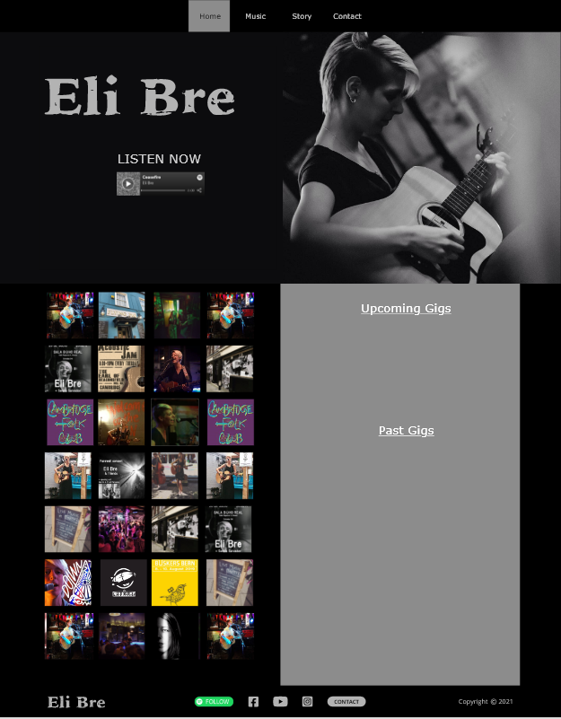

Mobile Wireframe:

  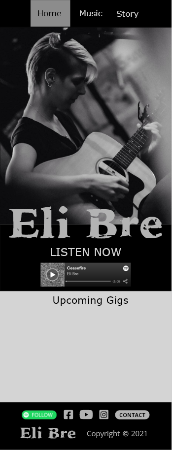

Contact Page Wireframe:

  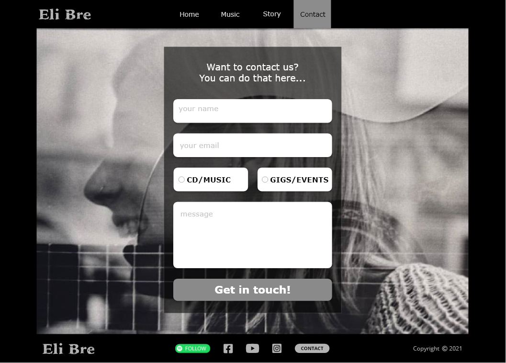       

## 1.4. Surface
  [Go to the top](#table-of-contents)

### Colours
The main colours for this are black (#000) and gray (#b3b3b3).

### Typography
The font used throughout the project is Verdana with Sans Serif as the fallback font in case for any reason the font isn't being imported into the site correctly.

### Imagery
All imagery are relevant to the artist and her own property.

# 2. Features
  [Go to the top](#table-of-contents)

According to [Designs Desk](https://www.designsdesk.com/91/10-essential-website-features-every-site-needs-to-be-successful/), the 10 essential website features every site needs to be successful are:
  1. A Catchy URL
  2. Essential Info
  3. Contact Us Section
  4. Easy-to-Navigate
  5. Secure Website
  6. Social Media Presence
  7. Mobile Friendly Website
  8. Great Content
  9. Good Hosting
  10. Great Design

### Existing Features

- __Navigation Bar__

  - Featured on all pages, the navigation bar includes links to the Home page via the Home tab or the logo on all pages except on the landing page to avoid repetition. Other links include the Music page, Story page and Contact page and is identical in each page to allow for easy navigation. For the mobile version, the Contact page link has been removed to allow easier navigation and can be found in the footer section.
  - This section will allow the user to easily navigate from page to page across all devices without having to revert back to the previous page via the ‘back’ button. 

- __The landing page__

  - This section introduces the user to Eli Bre with an eye catching picture and a Call to Action.
  - A music player has been added so potential fans and industry representative can hear a taste of what Eli Bre has to offer. 

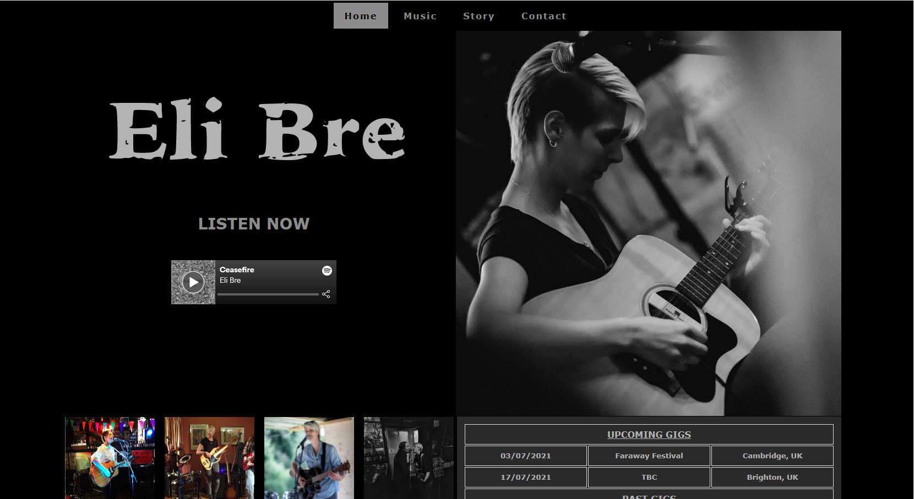

- __Gigs Section__

  - This section can be found on the Home page, below the fold. It aims to showcase Eli Bre's upcoming and past gigs.
  - To add value to this section, a gallery of pictures has been added to complement the gigs' table. The gallery presents pictures of Eli Bre giging and recording as well as venues and events posters.

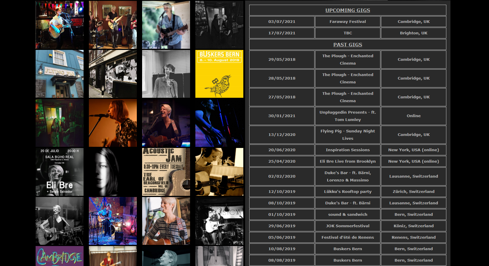

- __The Footer__ 

  - The footer section includes an embedded Spotify follow button, links to Eli Bre's social media sites and a link to the contact page. The social media links will open to a new tab to allow easy navigation for the user. 
  - The footer is valuable to the user as it encourages them to keep connected via social media and also provides a link to the contact page for desktop and mobile versions.

- __Music page__

  - The Music page primarily displays Eli Bre's music videos on one scrollable page.
  - This section is valuable to the user as they will be able to easily watch one video after another on a same page. 

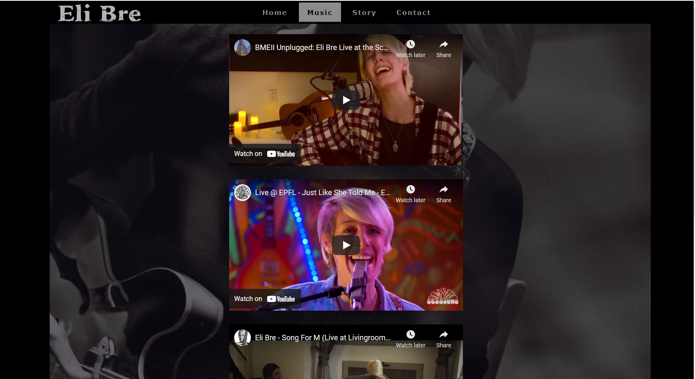

- __Story page__

  - The Story page provides the user with a brief biography of the artist. 
  - As the client speaks several languages and performs in various countries, automatic translations have been provided to retain user presence and add value to the site. 

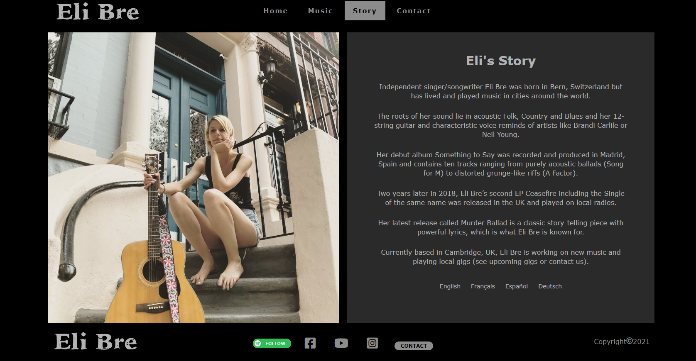

- __Contact Page__

  - This page will allow the user to contact the artist if interested in buying music, enquiring for gigs or for other matters.

### Features Left to Implement

- A mailing list sign–up – a mailing list sign-up form on the main page of the website so readers can’t miss it. Email is the most direct and effective way to contact fans, so it should be made easy and appealing to join the mailing list.
- A music and merch store – selling merchandise directly from the website will make the artist look professional and serious about their music career. The artist can keep a higher cut of the royalties this way, too. 
- Fully responsive design for all devices (i.e. not just for desktop and mobile)

## 3. Technologies Used
  [Go to the top](#table-of-contents)

* [Adobe XD](https://www.adobe.com/uk/products/xd.html?sdid=88X75SKR&mv=search&ef_id=CjwKCAjwzMeFBhBwEiwAzwS8zEdg1c5loBLcgbV5LTjaYi7O3-GLU0Gzv4EV_lO9A4Z9kiXtmX-x4RoClvYQAvD_BwE:G:s&s_kwcid=AL!3085!3!473161431558!e!!g!!adobe%20xd!1642716928!71269819668) for wireframes design.
* [Visual Studio Code](https://code.visualstudio.com/) originally used to write code, but then switched to gitpod as suggested by CI.
* [Gitpod](https://www.gitpod.io/) for writing most of the code as well as the readme file.
* [HTML5](https://en.wikipedia.org/wiki/HTML5) as this project uses HyperText Markup Language.
* [CSS3](https://en.wikipedia.org/wiki/Cascading_Style_Sheets) as this project uses Cascading Style Sheets.
* [Google Chrome DevTool](https://www.google.com/intl/en_uk/chrome/) for debugging.
* [GitHub](https://github.com/) for deployment.

# 4. Testing
  [Go to the top](#table-of-contents) 

## Manual Testing

The site has been tested on various browsers such as Google Chrome, Safari and Mozilla Firefox, on multiple devices such as desktop, laptop, tablet and mobile.
The site has also been shared with the client to gather her feedback.

Below is the testing process for all pages on desktop and mobile versions:

### All pages:
  - Navigation Bar:
    - Home 
      - When selecting "Home", the browser redirects to the Home page. The text in the navigation bar is highlighted with a gray background for ease of navigation. Internal link works as expected.
    - Music 
      - When selecting "Music", the browser redirects to the Music page. The text in the navigation bar is highlighted with a gray background for ease of navigation. Internal link works as expected.
    - Story 
      - When selecting "Story", the browser redirects to the Story page. The text in the navigation bar is highlighted with a gray background for ease of navigation. Internal link works as expected.
    - Contact 
      - When selecting "Contact", the browser redirects to the Contact page. The text in the navigation bar is highlighted with a gray background for ease of navigation. Internal link works as expected.

  - Text:
    - All text is in the correct and consistent size, font and color. Text has also been checked for typos.

  - Media:
    - All images load on the page. All images have alt text equivalent in a contrasted color if not loading or for visually impaired users. Working as expected.

  - Responsiveness:
    - Responsiveness has been more challenging than expected. After adding all media queries, the site was not behaving accordingly. While testing on various viewport, I noticed that previously centered elements would move out of their original places. From now on, I will start with a mobile-first design and work my way up to wider viewports.

  - Footer:
    - Spotify follow button - When the Follow button is clicked, a pop-up window opens to Eli Bre's Spotify page. I suspect that once you follow the artist, the button becomes obsolete.
    - Facebook - When the Facebook icon is clicked, a new tab opens and redirects to Eli Bre's Facebook page. Working as expected.
    - YouTube - When the YouTube icon is clicked, a new tab opens and redirects to Eli Bre's YouTube channel. Working as expected.
    - Instagram - When the Instagram icon is clicked, a new tab opens and redirects to Eli Bre's Instagram page. Working as expected.
    - Contact - when the Contact button is clicked, the browser redirects to the Contact page. Working as expected.

### Music page:
  - Videos:
    - All videos load on the page and when clicked, display the video with sound. Working as expected.
    - When the "Watch on Youtube" button is clicked, the browser redirect the user to the appropriate Youtube page, on a new tab. Working as expected.

### Story page:
  - Translations:
    - Each of the four languages options load appropriately. Working as expected.

### Contact page:
  - Contact form:
    - Testing that each field of the form is required before submitting. Working as expected.
    - Checking that the submit button works and processes the form.

## Automated testing

### W3C Validator Tools

The W3C Markup Validator and W3C CSS Validator Services were used to validate every page of the project to ensure there were no syntax errors in the project.

- [Markup Validation Service](https://validator.w3.org/)
  - All errors found came from the Youtube iframes included as well as the svg logo. I did not dare to amend this errors in case it affects the content.
- [W3C CSS Validator](https://jigsaw.w3.org/css-validator/validator.html.en)
  - No Error Found.

# 5. Known Bugs
  [Go to the top](#table-of-contents)

- Home Page - Mobile version - Table
  I would have liked the date column to be less wide, to give more space to the middle column. I did not succeed to fix this.

- Footer - Desktop and mobile versions - Contact button
  The contact button is not aligned with the other elements of the footer. DevTools show a different margin compared to the other elements. See pictures below. I did not succeed to fix this.

  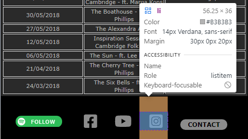
  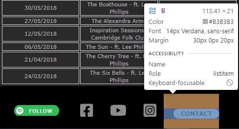 

- Responsive design
  I understand this first assignment was supposed to be fully responsive, whereas this submitted project is only responsive for desktop, laptop and mobile. To make this project and future ones responsive, from now on I will start with a mobile-first design as well as learning more about relative units such as em and rem, and also libraries such as Bootstrap. 

# 6. Deployment
  [Go to the top](#table-of-contents)

GitHub pages was used to deploy the final project. 
Below is the step by step process for deployment:

  1. Log in to GitHub and locate the [GitHub Repository](https://github.com/)
  2. At the top of the Repository (not top of page), locate the "Settings" Button on the menu.
  3. Scroll down the Settings page until you locate the "GitHub Pages" Section.
  4. Under "Source", click the dropdown called "None" and select "Master Branch".
  5. The page will automatically refresh.
  6. Scroll back down through the page to locate the now published site [link](https://github.com) in the "GitHub Pages" section.

# 7. End Product
  [Go to the top](#table-of-contents)

Below are screenshots of the end product, for desktop and mobile:

Home page:
  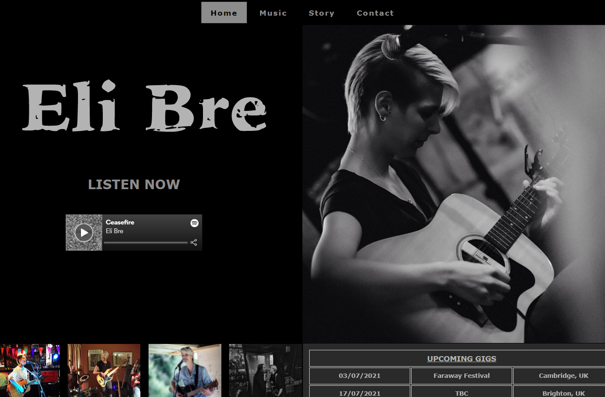
  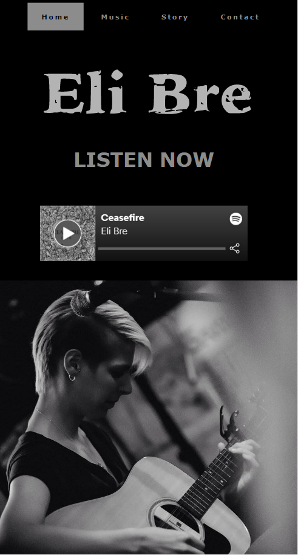

Music page:
  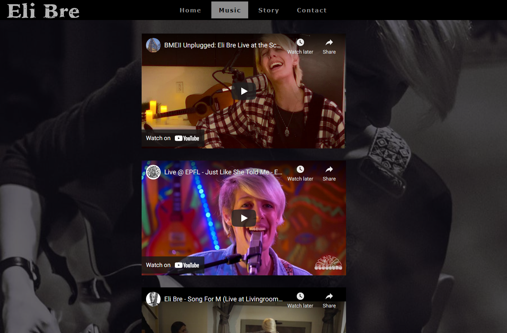
  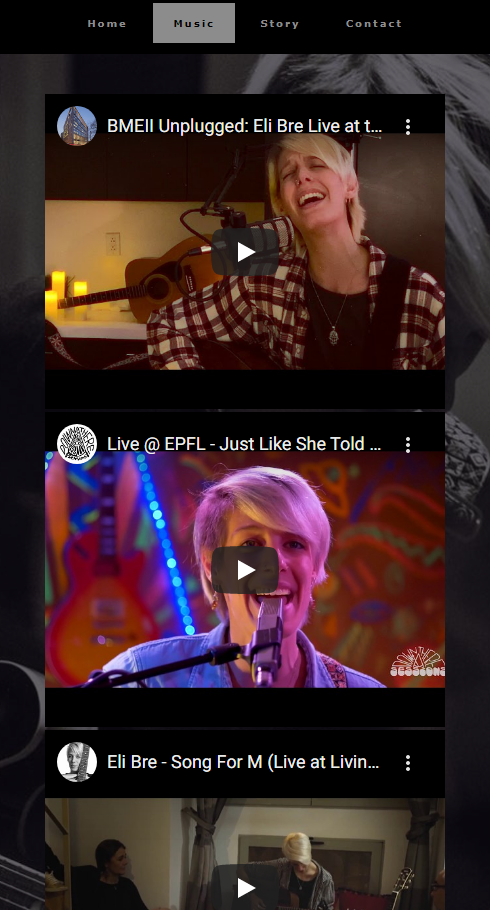

Story page:
  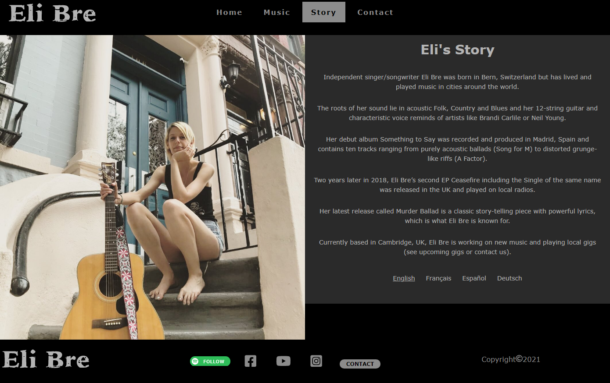
  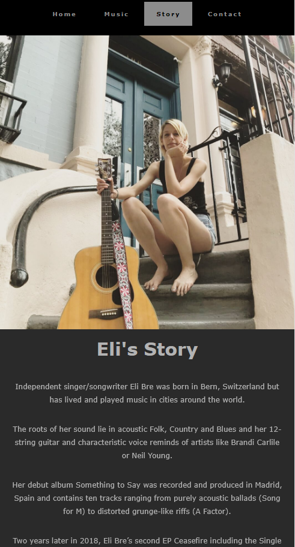

Contact page:
  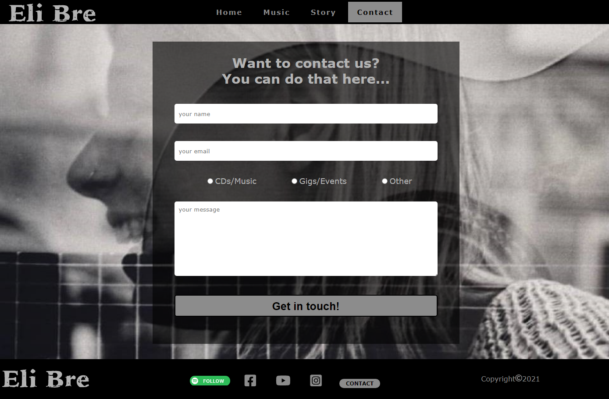
  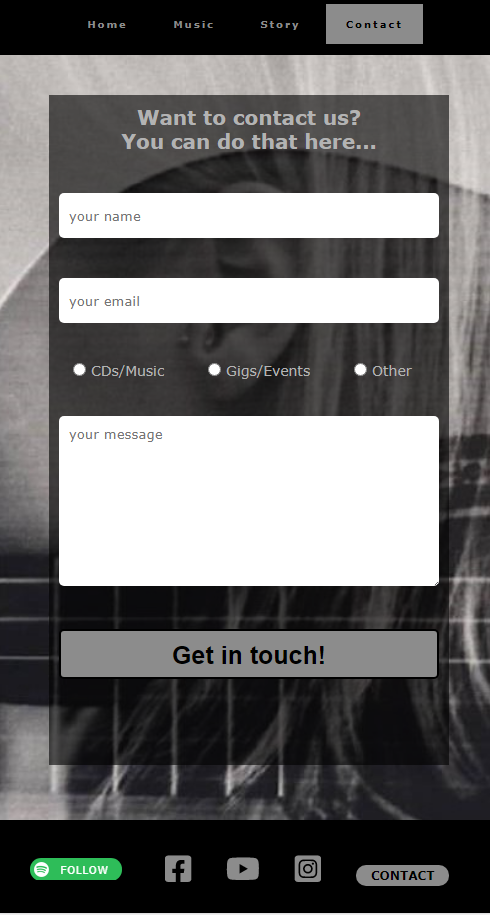

# 8. Credits
  [Go to the top](#table-of-contents)

### Design

- [Dribbble](https://dribbble.com/): for inspiration.
- [DesignCourse Youtube Channel](https://www.youtube.com/c/DesignCourse/videos): for great tutorials from design to html &amp; css.

### Code

- [MDN Web Docs](https://developer.mozilla.org/): for refreshers on standard practices.
- [W3Schools](https://www.w3schools.com/): for more refreshers on standard practices.

### Content 

- All content was written by the client Eliane Brechbühl.
- The icons in the footer were taken from [Font Awesome](https://fontawesome.com/)

### Media

- All images were provided by the client Eliane Brechbühl.

### Acknowledgements

- My new Mentor Marcel for accepting to support me at the last minute and for his valuable advice.